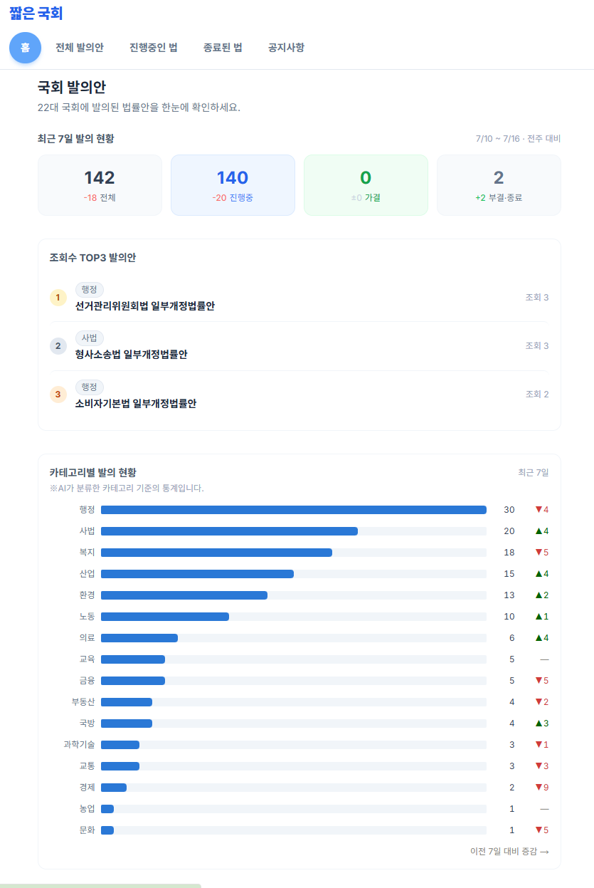
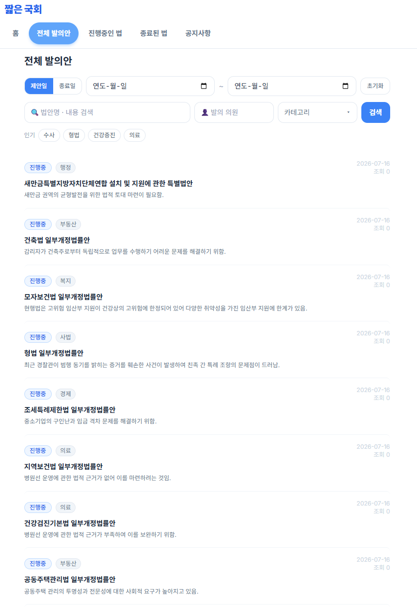
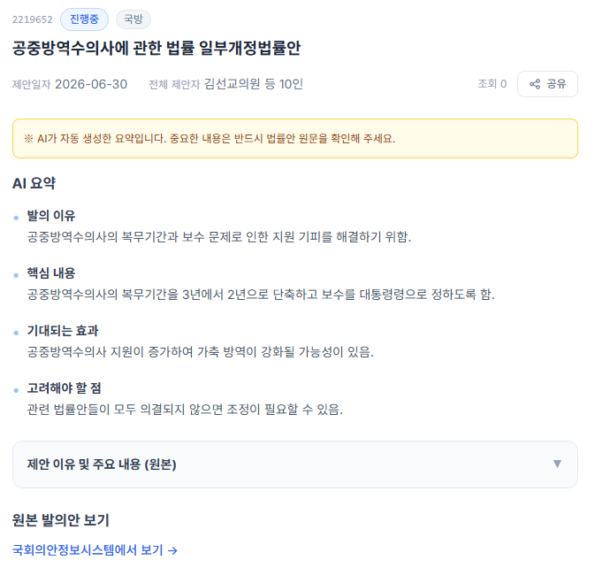
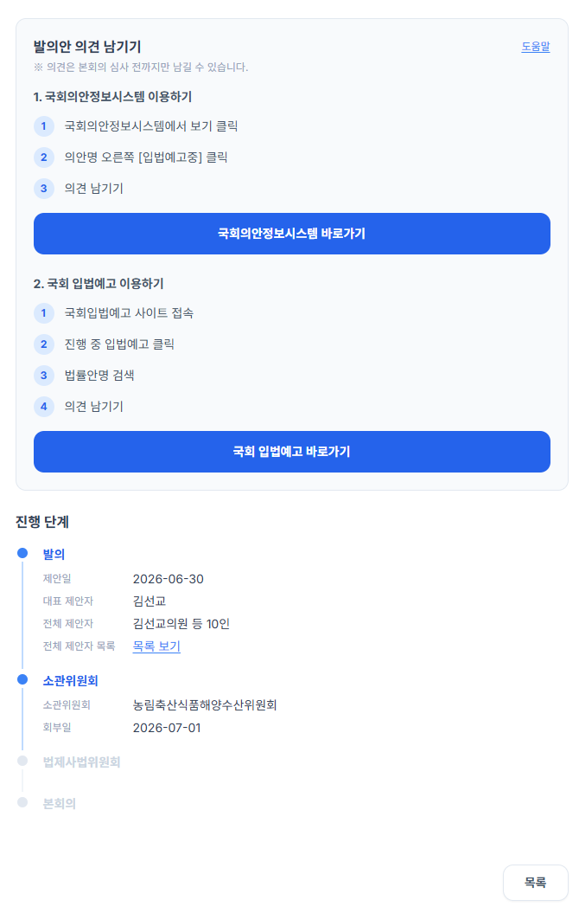

# 국회 발의안 AI 요약 제공 웹사이트

대한민국 국회에 발의되는 법률안을 자동으로 수집하고, AI로 일반 시민이 이해하기 쉽게 요약·분류해 보여주는 웹 서비스입니다.

**배포 링크**: [jalbun.vercel.app](https://jalbun.vercel.app)

## 소개

국회에는 매일 수십 건의 법률안이 발의되지만, 원문은 법률 용어로 되어 있어 일반 시민이 내용을 파악하기 어렵습니다. 이 프로젝트는 국회 Open API로 법률안 데이터를 자동 수집하고, OpenAI API로 발의 이유·핵심 내용·기대 효과·고려할 점을 4줄로 요약해 누구나 쉽게 법률안의 흐름을 확인할 수 있도록 만들었습니다.

## 주요 기능

- **발의안 목록/검색** — 키워드, 발의 의원, 제안일·의결일 날짜 범위, 카테고리 다중 선택, 진행 상태(진행중/가결/부결/철회 등)로 필터링
- **AI 자동 요약 및 카테고리 분류** — 법률안 원문을 발의 이유·핵심 내용·기대 효과·고려할 점 4가지 항목으로 요약하고, 17개 카테고리(경제·노동·교육·복지 등) 중 하나로 자동 분류
- **홈 대시보드** — 최근 7일 발의 현황 통계(전주 대비 증감 포함), 카테고리별 주간 발의 추이 차트(막대 클릭 시 해당 조건으로 필터링된 목록으로 이동), 조회수 TOP3 법률안, 국회 의석 현황 시각화
- **법률안 상세 페이지** — 발의 → 소관위원회 → 법제사법위원회 → 본회의 진행 단계를 타임라인으로 표시, 원문 링크, 의견 제출 방법 안내(국회의안정보시스템/국회입법예고 두 가지 경로 + 스크린샷 가이드 페이지)
- **자동 수집/갱신** — GitHub Actions로 매주 화~토 오전 국회 Open API를 조회해 신규 법률안 수집 및 진행 상태 갱신
- **관리자 페이지** — 공지사항 작성/수정, 사용자 피드백 및 오류 신고 조회

## 기술 스택

| 구분 | 기술 |
|---|---|
| Frontend | Next.js 15 (App Router), React, TypeScript, Tailwind CSS |
| Backend / DB | Supabase (PostgreSQL), Row Level Security |
| 데이터 수집 / AI | Python, 국회 Open API, OpenAI API |
| 자동화 | GitHub Actions (cron 스케줄링) |

## 아키텍처

```
국회 Open API
   │  (법률안 목록 · 제안이유 · 상세정보)
   ▼
Python 스크래퍼 (scrapers/)
   │  수집 → OpenAI로 요약/카테고리 분류 → Supabase 저장
   ▼
Supabase (PostgreSQL)
   ▼
Next.js 웹 서비스 (src/)
   │  검색 · 통계 · 상세 페이지 렌더링
   ▼
사용자
```

GitHub Actions가 매주 화~토 오전 위 파이프라인의 수집·갱신 단계를 자동 실행합니다.

## 기술적으로 고민한 부분

- **검색 성능** — 법률안명/요약 부분 검색(ILIKE)이 인덱스를 못 타는 문제를 `pg_trgm` GIN 인덱스로 해결하고, 카테고리 필터 + 날짜 정렬이 함께 쓰이는 조회 패턴에 맞춰 복합 인덱스를 설계
- **상태 파생 로직** — 법률안의 진행 상태가 소관위원회·법제사법위원회·본회의 세 단계 중 어느 곳에서 확정되는지가 제각각이라, 각 단계의 처리 결과를 우선순위에 따라 검사해 하나의 `status` 값으로 정규화하는 로직을 작성
- **자동화 파이프라인** — GitHub Actions에 Secrets로 API 키를 관리하고, 원하는 실행 요일(화~토)을 UTC/KST 시차를 고려한 cron 표현식으로 변환해 스케줄링

## 트러블슈팅 — 진행중 법안 갱신(Track B) 성능 개선

**문제**: 매 실행마다 "진행중" 상태인 법안 전체를 대상으로 국회 3차 API를 조회하고 DB에 UPDATE했습니다. 소관위 회부일처럼 자주 안 바뀌는 값도 실제 변경 여부와 무관하게 매번 write가 발생했고, 진행중 법안 수가 늘어날수록 실행 시간이 선형으로 늘어나는 구조였습니다.

**원인 분석**: 세 가지가 겹쳐 있었습니다.
1. 새로 받아온 값과 DB의 기존 값을 비교하는 로직이 아예 없어서, 값이 하나도 안 바뀐 법안도 무조건 UPDATE
2. 국회 3차 API 호출이 법안 수만큼 순차(for loop)로 실행 — 서로 의존관계가 없는 호출인데도 하나씩 기다렸다가 다음 호출
3. DB에 쓸 때도 법안 하나당 UPDATE 쿼리 하나씩 개별 호출

**해결**:
1. `get_pending_bills()`가 비교에 필요한 컬럼까지 함께 조회하도록 확장하고, `diff_bill_update()`로 새 값과 기존 값을 필드별로 비교해 실제로 달라진 법안만 걸러냄
2. `ThreadPoolExecutor(max_workers=8)`로 국회 3차 API 호출을 병렬화 — 서로 독립적인 요청이므로 동시에 여러 건을 진행
3. 변경이 감지된 법안만 모아 `upsert_bill_updates()`로 청크 단위(500건) 배치 upsert — 개별 호출을 최소화

**Before / After**

| 항목 | 이전 | 이후 |
|---|---|---|
| 국회 API 호출 방식 | 순차 (for loop, 1건씩 대기) | 병렬 (ThreadPool, 동시 8건) |
| DB write 대상 | 진행중 법안 전체, 변경 여부 무관 | 실제로 값이 달라진 법안만 |
| DB 쓰기 방식 | 법안마다 개별 UPDATE 쿼리 | 변경분을 모아 청크 단위 배치 upsert |
| 실행 시간 | _(측정 예정)_ | _(측정 예정)_ |
| 조회 대비 실제 갱신 건수 | 전체 write (100%) | _(측정 예정)_ |

## 폴더 구조

```
scrapers/                        # 국회 Open API 수집 + AI 요약 (Python)
  api/
    assembly_bill.py             # 법률안 수집 및 상태 갱신
    assembly_initiative_statistic.py  # 카테고리별 일별 통계 집계
    assembly_seats.py            # 국회 의석 현황 수집
  utils/
    ai_client.py                 # OpenAI 요약/분류 프롬프트
    supabase_client.py           # Supabase 저장/조회

src/
  app/
    bills/                       # 목록 · 검색 · 상세 · 의견 제출 가이드
    admin/                       # 관리자 페이지 (공지사항, 피드백, 오류 신고)
    api/                         # API 라우트
  components/                    # 차트, 목록, UI 컴포넌트
  lib/                           # Supabase 클라이언트, 타입 정의

.github/workflows/                # GitHub Actions 자동화 스케줄
```

## 실행 방법

```bash
# 프론트엔드
npm install
npm run dev

# 데이터 수집 (Python)
cd scrapers
pip install -r requirements.txt
python api/assembly_bill.py
python api/assembly_initiative_statistic.py
```

환경변수는 `.env.local`(Next.js)과 `scrapers/.env`(Python)에 각각 Supabase URL/키, OpenAI API 키, 국회 Open API 키를 설정해야 합니다.

## 스크린샷

| 홈 대시보드 | 전체 발의안 목록 |
|---|---|
|  |  |

| 상세 페이지 — AI 요약 | 상세 페이지 — 의견 남기기 |
|---|---|
|  |  |
